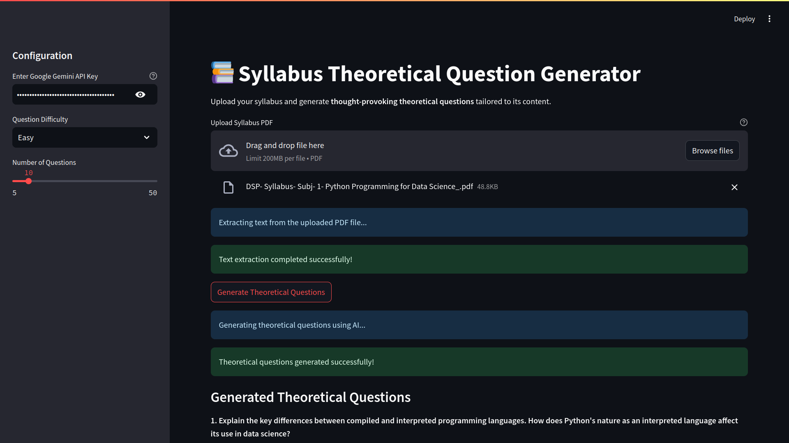
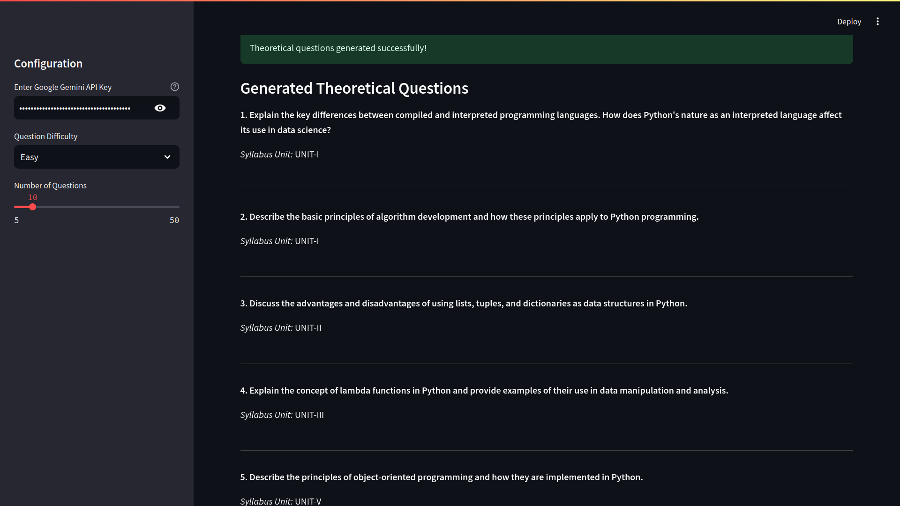

# 📚 Syllabus Theoretical Question Generator

Hey there, educator and question-crafting enthusiast! 👋 This Streamlit app is your new best friend for generating thought-provoking theoretical questions directly from syllabus PDFs.

## 🌟 Project Overview

Ever spent hours manually creating exam questions? Say goodbye to that! This app uses Google's Gemini AI to automatically generate theoretical questions based on your syllabus content. Customize difficulty, question count, and get unique, context-rich questions in seconds.

## 📸 Screenshots




## 🛠 Setup with Conda (Your New Best Friend!)

### Why Conda? 
Conda is like a magical environment manager that'll keep your project dependencies neat and tidy. No more "it works on my machine" headaches! 🧙‍♀️

### Step-by-Step Conda Setup

1. **Install Anaconda or Miniconda**
   - Download from [Anaconda's official site](https://www.anaconda.com/products/distribution)
   - Follow the installation wizards (they're pretty straightforward!)

2. **Create a Conda Environment**
   ```bash
   # Create a new environment (let's call it 'syllabus-gen')
   conda create -n syllabus-gen python=3.12 -y

   # Activate the environment
   conda activate syllabus-gen
   ```

3. **Clone the Repository**
   ```bash
   git clone https://github.com/nimish-nimishmittal/ai-syllabus-prep.git
   cd syllabus-question-generator
   ```

4. **Install Dependencies**
   ```bash
   # Install dependencies using pip
   pip install -r requirements.txt
   ```

5. **Get Your Gemini API Key**
   - Visit [Google AI Studio](https://makersuite.google.com/app/apikey)
   - Create a new API key
   - Keep it handy for the app!

## 🚀 Running the App

```bash
# With your Conda environment activated
streamlit run main.py
```

## 🔑 Key Dependencies

- Streamlit
- PyPDF2
- Google Generative AI
- Logging

## 🤝 Contributing

1. Fork the repo
2. Create your feature branch (`git checkout -b feature/AmazingFeature`)
3. Commit your changes (`git commit -m 'Add some AmazingFeature'`)
4. Push to the branch (`git push origin feature/AmazingFeature`)
5. Open a Pull Request

## 📜 License

Hey, have a look at the license - [MIT License](LICENSE)
However it doesn't matter for this use case.

## 🙌 Acknowledgements

- Google's Gemini AI
- Streamlit Community
- All the coffee ☕ that made this possible